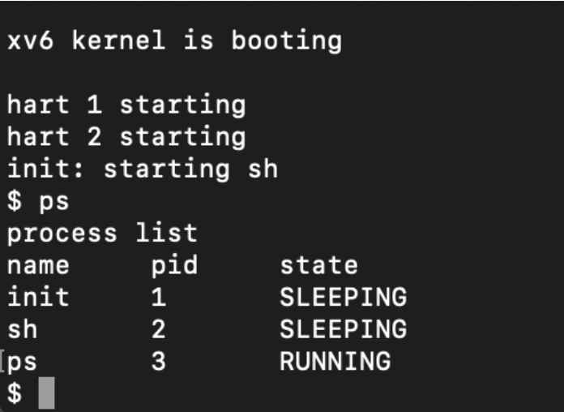
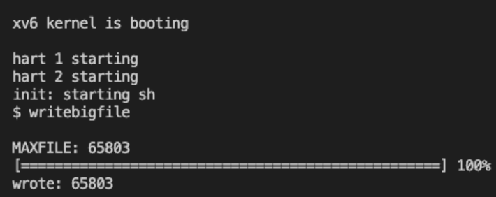

# Implementation of new features in xv6

 - ## Syscall ps

    the syscall returns the list of active processes with their pid, the syscall was implemented by exporting the process table.	

    ```
        ps
    ```
    

- ## Implementation of double indirection

    The second feature implemented is the increase of the maximum size of a file within the operating system.

    Initially, files in xv6 are limited to 268 blocks. 
    This limit comes from the fact that an xv6 inode contains 12 direct blocks and a single indirect block number, pointing to a block containing up to 256 blocks, for a total of 12+256=268
    The purpose of this implementation is to increase the above limit by inserting a double indirect block, so an inode can contain: 11+256 + 2562= 65803 blocks.

    By selecting the writebig test via the 'writebigfile' command, or via 'usertests writebig', the largest possible file is created and the size is reported.

    ```
        writebigfile
    ```

    ```
        usertests writebig
    ```

     
